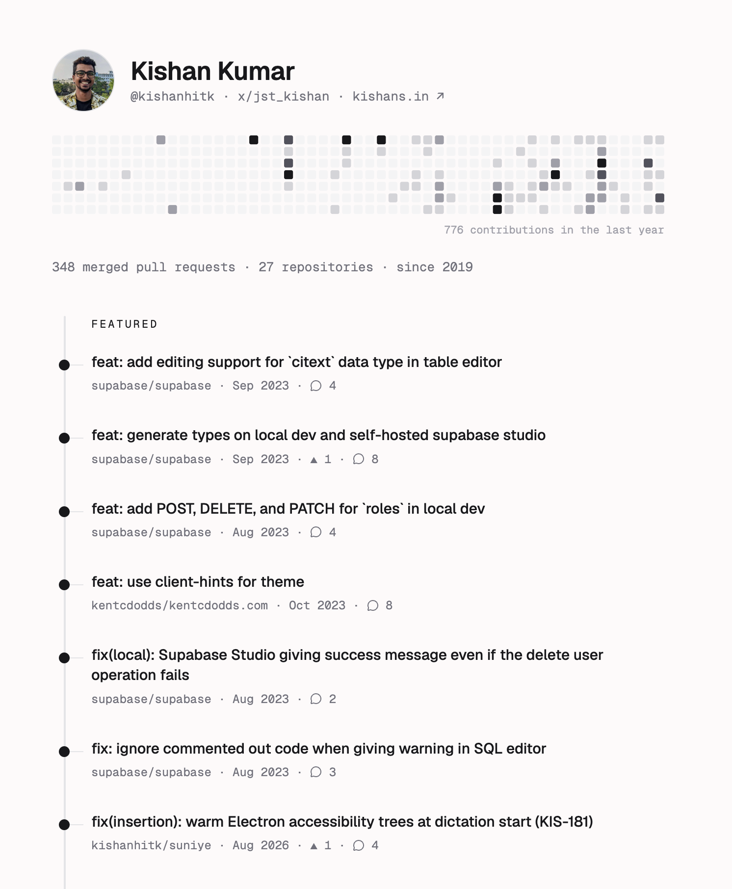

<div align="center">

# MyPRs

### One link to highlight your open-source contributions.

The "link-in-bio" for your GitHub pull requests. Curate your proudest PRs,
showcase your expertise, and stand out — with a single shareable link.

**[myprs.dev](https://myprs.dev)** · `myprs.dev/your-github-username`

<p align="center">
  
</p>

</div>

## Why MyPRs

Your best work as a developer often lives in pull requests scattered across
other people's repositories — invisible on your GitHub profile. MyPRs pulls
them together on one page you can put in your bio, resume, or job application.

- **Instant profile** — visit `myprs.dev/<username>` and your merged PRs are
  already there. No setup required.
- **Curate what matters** — sign in with GitHub to feature your proudest PRs
  and hide noisy repositories.
- **Built to share** — clean link, rich social cards with per-profile OG
  images, and a one-click share button.
- **Looks good everywhere** — responsive, dark mode, GitHub contribution
  chart included.

## How it works

1. Open `myprs.dev/<your-github-username>` — merged PRs load straight from
   the GitHub API.
2. **Continue with GitHub** to claim your profile.
3. Star ⭐ PRs to feature them at the top; filter out repositories you don't
   want shown.
4. Share your link.

## Tech stack

- [Next.js 16](https://nextjs.org) — App Router, React Server Components, Server Actions
- [React 19](https://react.dev) · [Tailwind CSS 4](https://tailwindcss.com) · [shadcn/ui](https://ui.shadcn.com)
- [Supabase](https://supabase.com) — GitHub OAuth via `@supabase/ssr`, Postgres with RLS
- [Vercel](https://vercel.com) — hosting and preview deployments

## Local development

```sh
bun install

# local Supabase (Docker required); prints the URL + anon key
supabase start

cp .env.example .env.local   # fill in the values from `supabase start`

bun run dev                  # http://localhost:3000
```

Optionally set `GITHUB_TOKEN` in `.env.local` to raise the GitHub API rate
limit. `npm` works everywhere `bun` is shown.

Other scripts: `bun run build`, `bun start`, `bun run typecheck`, `bun run lint`.

## Deployment

Deploys to Vercel with zero config — Next.js is auto-detected. Set the
environment variables from `.env.example` (`NEXT_PUBLIC_*` plus
`GITHUB_TOKEN`) in the Vercel project settings.

## Contributing

Issues and PRs are welcome. If you ship something you're proud of —
[feature it on your MyPRs](https://myprs.dev).
